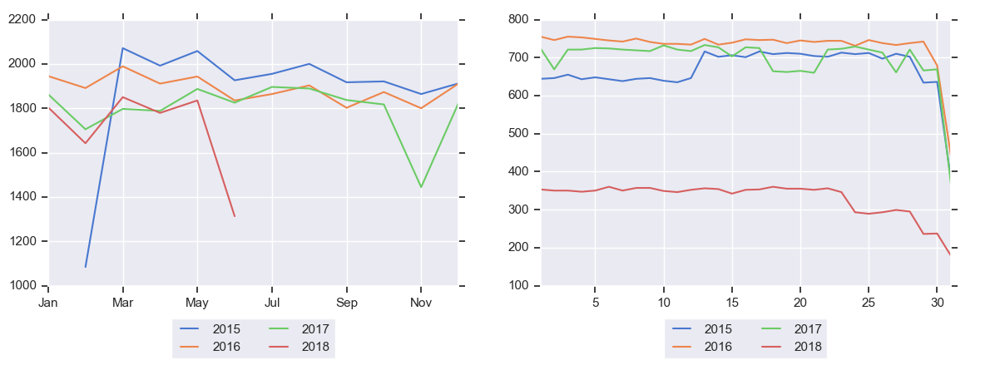

# Introduction
pyEDA is a python 3.6+ package for basic exploratory data analysis,
creating an HTML profile reports from a pandas DataFrame.The pandas df.describe() function is great but a little basic
for exploratory data analysis.
Future implementations will have features like text analysis as well.

# Functionalities/features
For each column the following statistics are presented in an HTML report:  
•Essentials: Data shape, size, type, unique values/percentage, missing values/percentage along with data preview.   
•Data summary statistics like minimum value, Q1, median, Q3, maximum, range, interquartile range.  
•Kurtosis and skewness plot.  
•Missing and distinct percentage value plot.  
•Missing value visual plot for pattern recognition.  
•Count plot for categorical columns.  
•Text and DateTime column handling.  
•Histogram/distribution plot for numerical columns.  
•Box plot for numerical columns.  
•Correlations plt highlighting highly correlated variables, this module is using pearson matrix.  
•Row wise missing info,  
example: Let us say, in a data set with 10 columns if a particular row is having 5 or more column  
         values missing then those rows will be captured in this table.  
•Date/Time column exploration,  
example: If there is a unavailable period in data, this functionality will give a  
line plot data aggregated monthly and daily. Any discontinuity in the line shows data unavailability for that specific  
period.  


# Getting Started
##Installation:
<b>Option 1 - pip install: </b> To pip install this package from the
git repository, simply pip install like you would any other package.
Note that you will use pip or pip3 depending on your default python
version (on CDSW use pip3). Be sure to install from the Terminal in
CDSW and to restart your session afterwards.

Example:
`pip3 install -e git+https://generalmills.visualstudio.com/ACE/_git/pyEDA@version2#egg=pyEDA`

<b>Option 2 - setup.py: </b> Clone the repository to your system and
use the setup.py to install the package from your terminal.

Example: python setup.py install

# Usage
## Example: Running the Exploratory Data Analysis and generating report.


```{python}
import pandas as pd
from DataProfiling import ExploratoraryDataAnalysis as eda


# create a pandas dataframe which we want to create EDA report on
data = pd.read_csv("df.csv")

# call data_profile with dataframe as input
eda.data_profile(dataframe = data)

```

## There are four optional parameters.
<b>1.target_variable</b> - This parameter is target variable which is used to plot aggregated sum w.r.t date column.  
<b>2.date_time_var</b> - It is a list of date column(feature), each column will be plotted showing any data  
unavailabillity and data count over that period.   
<b>3.col_to_be_excluded</b> - This is a list of columns which the user want to be excluded while performing the analysis.  
<b>3.file_name</b> - This parameter is used to give file name to the report.  
  
```{python}
import pandas as pd
from DataProfiling import ExploratoraryDataAnalysis as eda


# create a pandas dataframe which we want to create EDA report on
data = pd.read_csv("df.csv")

# passing the optional parameters
eda.data_profile(dataframe = data,file_name = 'mult_cat_daily_sales_jun25_format'
                 ,date_time_var = ['businessdate','businessdate_1'], target_variable = 'quantity', col_to_be_excluded = [])
```
<B>Note</B> : The source and target tables in the above example are 
dummy tables and if you don't have access to wksp_gbs_data_science_team
workspace you will get the authorization error in that case please use
schema/tables on which you have access to.


# Contribute
We welcome contributions and suggestions for improvements to this package. 
If you have access to this repo, feel free to submit a PR. We are working on 
moving this package to a more accessible location to make this easier.  
Future version might contain 

Please contact the EDC Data Science Team (GBS DATA SCIENCE DISTLIST)with any 
questions, concerns, or offers to contribute! 
